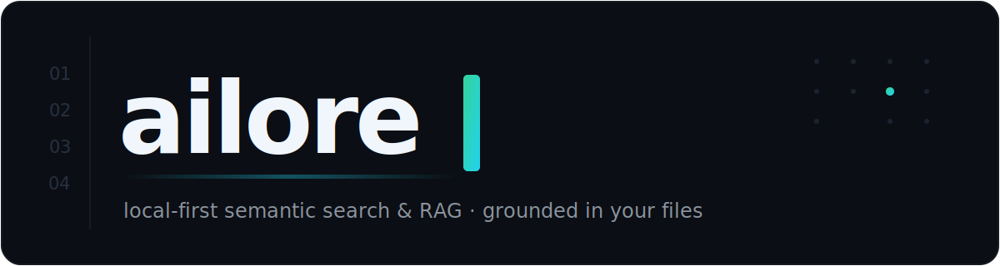

<div align="center">



<br>

**Local-first semantic search &amp; RAG for your codebase and docs.**

Ask in natural language, get answers grounded in _your own files_ — with exact `path:line` citations.<br>Runs fully offline with [Ollama](https://ollama.com), or with OpenAI, Gemini and OpenRouter.

<br>

[](https://www.npmjs.com/package/ailore)
[](https://www.npmjs.com/package/ailore)
[](https://github.com/gregdalzotto/ailore/actions/workflows/ci.yml)
[](./LICENSE)
[](https://nodejs.org)

[**Português 🇧🇷**](./README.pt-BR.md)

</div>

<br>

```console
$ ailore ask "how does hybrid retrieval combine BM25 and vector search?"

Hybrid mode runs two rankings over the same chunks — cosine similarity for
meaning and BM25 for exact tokens — then fuses them with Reciprocal Rank
Fusion, so the order reflects what both methods agree on. [core/retriever.ts:30-57]

Sources:
  core/retriever.ts:30-57
  core/bm25.ts:88-117
```

<br>

## What it does

- 🔍 **Hybrid search** — semantic (vector) and lexical (BM25) ranking fused, so it nails both concepts and exact symbols.
- 💬 **Grounded answers** (RAG) — a synthesized answer that cites the exact source lines it used.
- 🔒 **Local-first** — with Ollama, nothing ever leaves your machine: no API key, no cost.
- 🔌 **Provider-agnostic** — swap between Ollama, OpenAI, Gemini and OpenRouter with a single flag.
- 🧩 **MCP server** — `ailore mcp` exposes search/ask as tools to Cursor and any MCP-capable assistant.
- ⚡ **Incremental indexing** — only changed files are re-embedded; the index is a plain file, no database, no native modules.

<br>

## Quick start

```bash
# 1. Install (Ollama path = 100% local, no API key)
npm install -g ailore
ollama pull llama3.1 && ollama pull nomic-embed-text

# 2. Index a project
cd my-project && ailore index

# 3. Ask
ailore ask "where is the rate limiter implemented?"
```

> [!TIP]
> New here? The [**Getting started guide**](./docs/en/getting-started.md) walks you through it step by step — from installing models to your first cited answer.

<br>

## Demo

<div align="center">


</div>

<br>

## 📚 Documentation

| Guide                                              | What's inside                                              |
| -------------------------------------------------- | ---------------------------------------------------------- |
| 🚀 [Getting started](./docs/en/getting-started.md) | Install, models, first index, first answer — step by step. |
| ⌨️ [Commands](./docs/en/commands.md)               | `index`, `ask`, `search`, `init`, `mcp` and their flags.   |
| ⚙️ [Configuration](./docs/en/configuration.md)     | Config file, env vars, tuning generation & retrieval.      |
| 🎯 [Retrieval modes](./docs/en/retrieval-modes.md) | `hybrid` / `vector` / `keyword` and how RRF fusion works.  |
| 🔌 [Providers](./docs/en/providers.md)             | Ollama, OpenAI, Gemini, OpenRouter — mix and match.        |
| 🧩 [Editor / MCP integration](./docs/en/mcp.md)    | Wire `ailore` into Claude, Cursor and other MCP clients.   |
| 🛠️ [How it works](./docs/en/architecture.md)       | The scan → chunk → embed → retrieve → answer pipeline.     |
| 📦 [Use as a library](./docs/en/library-api.md)    | Embed the engine in your own tooling.                      |
| ❓ [FAQ](./docs/en/faq.md)                         | Languages, privacy, cost, troubleshooting.                 |

<div align="center"><sub><a href="./docs/en/README.md">Browse the full documentation hub →</a></sub></div>

<br>

## How it works

```
files ──▶ scan (respect .gitignore) ──▶ chunk (line-aligned) ──▶ embed ──▶ .ailore/index.json
                                                                              │
query ──▶ ┌─ cosine (semantic) ─┐                                            │
          ├─ BM25 (lexical) ────┤─ RRF fuse (top-k) ─▶ grounded prompt ─▶ LLM ┘──▶ answer + citations
          └─────────────────────┘
```

Chunking is line-aligned, so every retrieved chunk carries an exact `path:startLine-endLine` range — that's what makes the citations precise and verifiable. Full details in [How it works](./docs/en/architecture.md).

<br>

## Why the name?

**`ailore` = AI + lore.** _Lore_ is the accumulated, informal knowledge that gets buried in a codebase and usually lives only in the heads of the people who've been around longest. ailore reads your files and turns that hidden knowledge into answers you can ask for in plain language.

<br>

## Roadmap

- [ ] Approximate nearest-neighbour index for very large repos
- [ ] Watch mode (`ailore index --watch`)
- [ ] PDF and notebook ingestion
- [ ] Re-ranking step before generation

## Contributing

Contributions are welcome — see [CONTRIBUTING.md](./CONTRIBUTING.md).

## License

[MIT](./LICENSE) © [Gregori Dalzotto](https://github.com/gregdalzotto)
